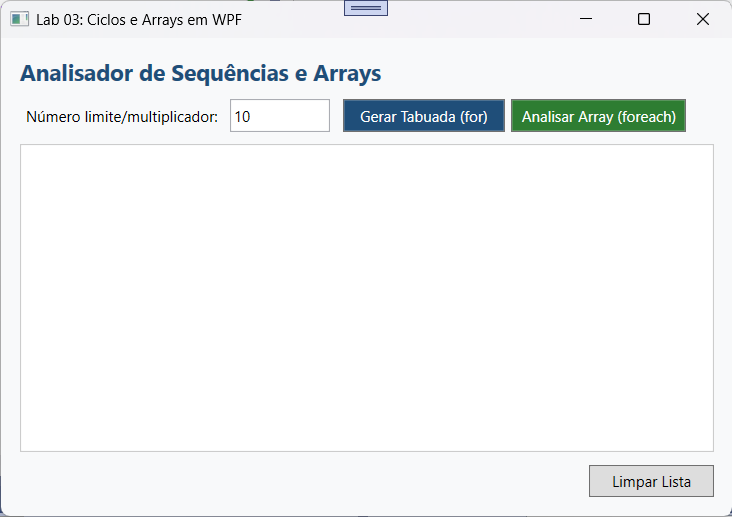
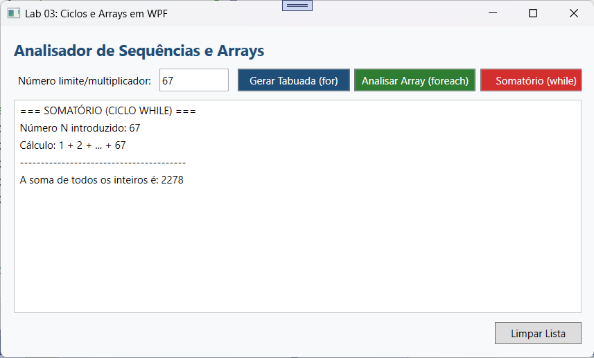
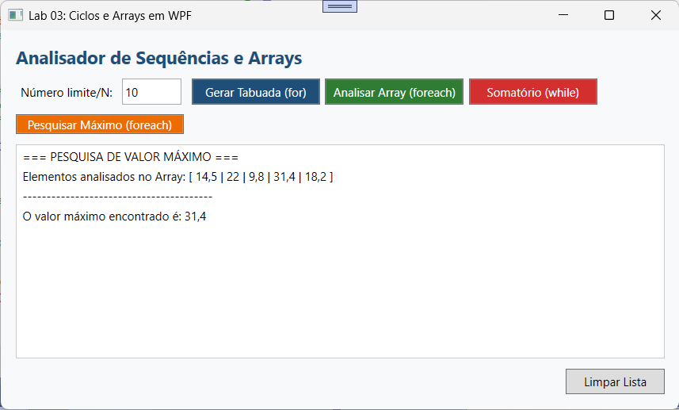
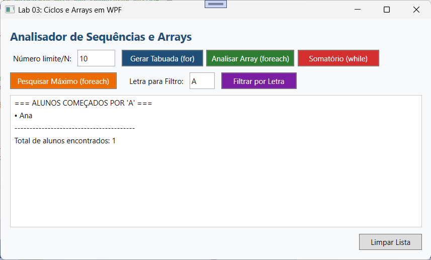

# AnalisadorDeSequenciasWPF

Neste laboratório, vais criar uma aplicação WPF que gera geradores numéricos com o ciclo for e processa arrays de nomes/notas com o ciclo foreach, exibindo os resultados dinamicamente numa ListBox.

## Exercício 1: Somatório e contagem com ciclo WHILE: 
Cria um novo botão na interface com o conteúdo 'Somatório (while)'. Ao ser clicado, o programa deve ler o número N da caixa de texto e, utilizando um ciclo 'while', calcular a soma de todos os números inteiros de 1 até N (1 + 2 + ... + N) e apresentar o resultado final na ListBox.

## Exercício 2: Pesquisa de valor Máximo num Array: 
Dado o array de valores decimais { 14.5, 22.0, 9.8, 31.4, 18.2 }, escrever um algoritmo utilizando o ciclo 'foreach' que determine qual é o maior valor presente no array e exiba a mensagem 'O valor máximo encontrado é: X' na ListBox.

## Exercício 3 (Desafio): Filtragem e Formatação de Strings em WPF: 
Declara um array de nomes de alunos: string[] alunos = { "Ana", "Bruno", "Carla", "Daniel", "Beatriz", " Bernardo" };. 
Cria um botão 'Filtrar por Letra' que leia uma letra introduzida pelo utilizador e, utilizando um ciclo 'foreach', exiba na ListBox apenas os alunos cujo nome começa por essa letra.

